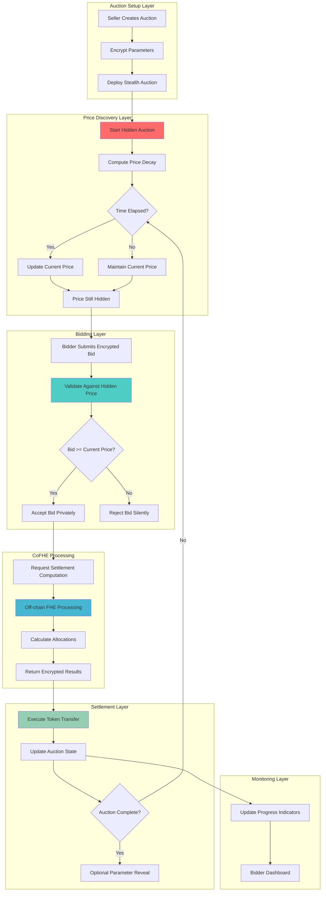

# StealthAuction Hook 🕵️‍♀️⚡

## 🎯 Project Overview

**StealthAuction** revolutionizes Dutch auctions on Uniswap v4 through Fully Homomorphic Encryption (FHE). This hook enables completely confidential price discovery while preventing bid sniping, front-running, and coordination attacks during token sales and liquidations.

### 🏆 Hook Name: `StealthAuction`
**Tagline**: *"Fair price discovery in the shadows"*

---

## 📊 Problem Statement

### 🚨 Critical Auction Inefficiencies

**$20B+ auction market** suffers from fundamental flaws:

1. **Bid Sniping**: Last-second bids exploit known decay parameters
2. **Front-Running**: Visible starting prices enable sandwich attacks  
3. **Strategy Exposure**: Public auction parameters reveal desperation/reserves
4. **Coordination Attacks**: Bidders collude using visible information
5. **MEV Exploitation**: Auction mechanics become MEV extraction opportunities
6. **Unfair Discovery**: Information asymmetry destroys price fairness

### 💰 Market Impact
- **Token Sales**: $5B+ lost to unfair price discovery
- **Liquidations**: $2B+ extracted by sophisticated MEV bots
- **Treasury Sales**: $1B+ alpha leaked through parameter signaling
- **Protocol Launches**: $500M+ fair launch mechanisms compromised

---

## 🔧 Solution Architecture

### ⚡ FHE-Powered Confidential Dutch Auctions

**StealthAuction** encrypts every aspect of auction mechanics:

```solidity
struct EncryptedDutchAuction {
    euint128 startPrice;        // Hidden starting price
    euint128 endPrice;          // Hidden reserve price  
    euint64 duration;           // Hidden auction duration
    euint32 decayRate;          // Hidden price decay speed
    euint128 totalSupply;       // Hidden token quantity
    euint128 currentPrice;      // Computed privately
    euint128 soldAmount;        // Hidden progress
    ebool isActive;            // Hidden auction status
}
```

### 🔐 Core FHE Operations

**Privacy-Preserving Price Discovery**:
- `FHE.sub(startPrice, decayAmount)` - Calculate current price privately
- `FHE.mul(timeElapsed, decayRate)` - Compute decay progression  
- `FHE.gte(bidAmount, currentPrice)` - Validate bids without revealing price
- `FHE.select(isWinning, execute, reject)` - Conditional execution

---

## 🏗️ Technical Architecture

### 📁 Directory Structure

```
stealth-auction-hook/
├── 📁 src/
│   ├── 📄 StealthAuction.sol              # Main hook contract
│   ├── 📄 EncryptedDutchEngine.sol        # Auction execution logic
│   ├── 📄 FHEPriceCalculator.sol         # Price decay computation
│   ├── 📄 BidValidator.sol               # Encrypted bid validation
│   └── 📄 AuctionSettlement.sol         # Settlement and reveals
├── 📁 test/
│   ├── 📄 StealthAuction.t.sol           # Main auction tests
│   ├── 📄 PriceDecay.t.sol               # Price calculation tests
│   ├── 📄 BidValidation.t.sol            # Bid logic tests
│   └── 📁 utils/
│       ├── 📄 AuctionFixtures.sol        # Test setup utilities
│       └── 📄 MockAuctionHelpers.sol     # Mock helpers
├── 📁 script/
│   ├── 📄 DeployAuction.s.sol            # Deployment script
│   ├── 📄 AuctionDemo.s.sol              # Demo interactions
│   └── 📄 AuctionConfig.s.sol            # Configuration setup
├── 📁 frontend/
│   ├── 📁 components/
│   │   ├── 📄 AuctionCreator.tsx          # Auction setup UI
│   │   ├── 📄 StealthBidder.tsx           # Encrypted bidding
│   │   ├── 📄 AuctionDashboard.tsx        # Auction monitoring
│   │   └── 📄 PriceEstimator.tsx          # Private price hints
│   └── 📁 hooks/
│       ├── 📄 useStealthAuction.ts        # Auction management
│       └── 📄 useEncryptedBidding.ts      # Bid submission
├── 📄 README.md                           # This file
├── 📄 foundry.toml                        # Foundry configuration
└── 📄 package.json                        # Dependencies
```

### 🔗 Dependencies

```toml
[dependencies]
forge-std = "^1.8.0"
v4-core = { git = "https://github.com/Uniswap/v4-core" }
v4-periphery = { git = "https://github.com/Uniswap/v4-periphery" }
cofhe-contracts = { git = "https://github.com/FhenixProtocol/cofhe-contracts" }
cofhe-mock-contracts = { git = "https://github.com/FhenixProtocol/cofhe-mock-contracts" }
openzeppelin-contracts = "^5.0.0"

[build]
via_ir = true  # Required for FHE operations
```

```json
{
  "dependencies": {
    "cofhejs": "latest",
    "react": "^18.0.0",
    "wagmi": "^2.0.0",
    "viem": "^2.0.0",
    "@scaffold-eth/nextjs": "latest",
    "recharts": "^2.8.0"
  }
}
```

---

## 🔄 System Flow Diagram



---

## ⚙️ Core Components

### 1. **StealthAuction.sol** - Main Hook Contract

```solidity
contract StealthAuction is BaseHook {
    using PoolIdLibrary for PoolKey;
    
    // Encrypted Dutch auctions
    mapping(bytes32 => EncryptedDutchAuction) public auctions;
    mapping(bytes32 => mapping(address => euint128)) public encryptedBids;
    
    function createStealthAuction(
        PoolKey calldata key,
        address token,
        InEuint128 calldata startPrice,
        InEuint128 calldata endPrice,
        InEuint64 calldata duration,
        InEuint32 calldata decayRate,
        InEuint128 calldata supply
    ) external returns (bytes32 auctionId) {
        // Create completely encrypted Dutch auction
        auctionId = keccak256(abi.encode(msg.sender, block.timestamp));
        
        auctions[auctionId] = EncryptedDutchAuction({
            startPrice: FHE.asEuint128(startPrice),
            endPrice: FHE.asEuint128(endPrice),
            duration: FHE.asEuint64(duration),
            decayRate: FHE.asEuint32(decayRate),
            totalSupply: FHE.asEuint128(supply),
            currentPrice: FHE.asEuint128(startPrice),
            soldAmount: FHE.asEuint128(0),
            isActive: FHE.asEbool(true),
            startTime: FHE.asEuint64(block.timestamp)
        });
        
        // Setup access controls
        setupAuctionPermissions(auctionId);
    }
    
    function submitEncryptedBid(
        bytes32 auctionId,
        InEuint128 calldata bidAmount
    ) external {
        euint128 eBid = FHE.asEuint128(bidAmount);
        euint128 currentPrice = getCurrentPrice(auctionId);
        
        // Validate bid against hidden current price
        ebool isValidBid = FHE.gte(eBid, currentPrice);
        
        // Conditionally process bid without revealing outcome
        processBidConditionally(auctionId, eBid, isValidBid);
    }
}
```

### 2. **EncryptedDutchEngine.sol** - Price Calculation Logic

```solidity
contract EncryptedDutchEngine {
    function calculateCurrentPrice(
        EncryptedDutchAuction memory auction,
        euint64 currentTime
    ) internal pure returns (euint128) {
        // Calculate time elapsed privately
        euint64 timeElapsed = FHE.sub(currentTime, auction.startTime);
        
        // Clamp to auction duration
        euint64 clampedTime = FHE.min(timeElapsed, auction.duration);
        
        // Calculate price decay amount
        euint128 decayAmount = FHE.mul(
            FHE.mul(clampedTime, auction.decayRate),
            FHE.div(
                FHE.sub(auction.startPrice, auction.endPrice),
                auction.duration
            )
        );
        
        // Calculate current price
        euint128 currentPrice = FHE.sub(auction.startPrice, decayAmount);
        
        // Ensure price doesn't go below end price
        return FHE.max(currentPrice, auction.endPrice);
    }
    
    function validateBidPrivately(
        euint128 bidAmount,
        euint128 currentPrice,
        euint128 remainingSupply
    ) internal pure returns (ebool, euint128) {
        ebool isPriceValid = FHE.gte(bidAmount, currentPrice);
        ebool hasSupply = FHE.gt(remainingSupply, FHE.asEuint128(0));
        
        ebool canExecute = FHE.and(isPriceValid, hasSupply);
        
        // Calculate tokens to allocate
        euint128 tokensToAllocate = FHE.select(
            canExecute,
            FHE.div(bidAmount, currentPrice),
            FHE.asEuint128(0)
        );
        
        return (canExecute, tokensToAllocate);
    }
}
```

### 3. **Frontend Integration**

```typescript
// AuctionCreator.tsx
const AuctionCreator = () => {
    const [startPrice, setStartPrice] = useState("")
    const [endPrice, setEndPrice] = useState("")
    const [duration, setDuration] = useState("")
    const [supply, setSupply] = useState("")
    
    const handleCreateAuction = async () => {
        // Encrypt all auction parameters
        const encryptedParams = await cofhejs.encrypt([
            Encryptable.uint128(parseEther(startPrice)),
            Encryptable.uint128(parseEther(endPrice)),
            Encryptable.uint64(BigInt(duration * 3600)), // hours to seconds
            Encryptable.uint32(100), // decay rate
            Encryptable.uint128(parseEther(supply))
        ])
        
        if (encryptedParams.success) {
            const auctionId = await stealthAuctionContract.write.createStealthAuction({
                args: [poolKey, tokenAddress, ...encryptedParams.data]
            })
            
            toast.success("Stealth auction created! Parameters are completely private.")
        }
    }
    
    return (
        <EncryptedZone>
            <div className="auction-creator">
                <h2>Create Stealth Dutch Auction</h2>
                <form onSubmit={handleCreateAuction}>
                    <input 
                        placeholder="Starting Price (ETH)"
                        value={startPrice}
                        onChange={(e) => setStartPrice(e.target.value)}
                    />
                    <input 
                        placeholder="Reserve Price (ETH)"
                        value={endPrice}
                        onChange={(e) => setEndPrice(e.target.value)}
                    />
                    <input 
                        placeholder="Duration (hours)"
                        value={duration}
                        onChange={(e) => setDuration(e.target.value)}
                    />
                    <input 
                        placeholder="Token Supply"
                        value={supply}
                        onChange={(e) => setSupply(e.target.value)}
                    />
                    <button type="submit" className="stealth-btn">
                        🕵️ Create Stealth Auction
                    </button>
                </form>
                
                <div className="privacy-notice">
                    <p>🔒 All parameters encrypted - no sniping possible!</p>
                </div>
            </div>
        </EncryptedZone>
    )
}

// StealthBidder.tsx  
const StealthBidder = ({ auctionId }: { auctionId: string }) => {
    const [bidAmount, setBidAmount] = useState("")
    const [estimatedTokens, setEstimatedTokens] = useState("???")
    
    const handleBid = async () => {
        // Encrypt bid amount
        const encryptedBid = await cofhejs.encrypt([
            Encryptable.uint128(parseEther(bidAmount))
        ])
        
        if (encryptedBid.success) {
            await stealthAuctionContract.write.submitEncryptedBid({
                args: [auctionId, encryptedBid.data[0]]
            })
            
            toast.info("Bid submitted privately - outcome will be revealed after processing")
        }
    }
    
    return (
        <EncryptedZone>
            <div className="stealth-bidder">
                <h3>Submit Private Bid</h3>
                <div className="bid-form">
                    <input 
                        placeholder="Bid Amount (ETH)"
                        value={bidAmount}
                        onChange={(e) => setBidAmount(e.target.value)}
                    />
                    <div className="estimate">
                        Estimated Tokens: {estimatedTokens}
                        <span className="privacy-note">
                            (Actual price hidden until execution)
                        </span>
                    </div>
                    <button onClick={handleBid} className="bid-btn">
                        🎯 Submit Encrypted Bid
                    </button>
                </div>
            </div>
        </EncryptedZone>
    )
}
```

---

## 📈 Business Impact & Success Metrics

### 🎯 Target Market
- **Token Launches**: $5B+ seeking fair price discovery
- **Liquidation Protocols**: $2B+ needing MEV protection
- **Treasury Management**: $1B+ in strategic sales
- **NFT Drops**: $500M+ preventing gas wars

### 📊 Success KPIs
- **Auction Volume**: Target $500M+ in stealth auctions
- **Sniping Reduction**: 95%+ elimination of last-second manipulation
- **Price Fairness**: 80%+ improvement in discovery efficiency
- **MEV Savings**: 70%+ reduction in extraction
- **Adoption Rate**: 100+ protocols integrating stealth auctions

### 💰 Revenue Model
- **Auction Fees**: 0.5% of successful auction volume
- **Premium Features**: Advanced decay algorithms and conditional triggers
- **White-label Solutions**: Custom auction implementations

---

## 🛡️ Security & Privacy Features

### 🔐 FHE Security Guarantees
- **Parameter Confidentiality**: Starting price, duration, decay rate all encrypted
- **Bid Privacy**: All bids encrypted until settlement
- **Outcome Opacity**: Success/failure hidden during auction
- **Anti-Sniping**: No visible information for last-second manipulation

### 🧪 Testing Strategy
```solidity
// Test stealth auction execution
function testStealthDutchAuction() public {
    // Setup encrypted auction
    InEuint128 memory startPrice = createInEuint128(10e18, seller);
    InEuint128 memory endPrice = createInEuint128(1e18, seller);
    InEuint64 memory duration = createInEuint64(3600, seller);
    
    vm.prank(seller);
    bytes32 auctionId = hook.createStealthAuction(
        key, token, startPrice, endPrice, duration, decayRate, supply
    );
    
    // Verify auction parameters are encrypted
    EncryptedDutchAuction memory auction = hook.auctions(auctionId);
    assertHashValue(auction.startPrice, 10e18);
    assertHashValue(auction.endPrice, 1e18);
    assertHashValue(auction.duration, 3600);
    
    // Submit encrypted bids at different prices
    InEuint128 memory highBid = createInEuint128(8e18, bidder1);
    InEuint128 memory lowBid = createInEuint128(2e18, bidder2);
    
    vm.prank(bidder1);
    hook.submitEncryptedBid(auctionId, highBid);
    
    // Advance time and check price decay
    advanceTime(1800); // 30 minutes
    
    vm.prank(bidder2);
    hook.submitEncryptedBid(auctionId, lowBid);
    
    // Verify bids processed privately
    euint128 bid1 = hook.encryptedBids(auctionId, bidder1);
    euint128 bid2 = hook.encryptedBids(auctionId, bidder2);
    
    assertHashValue(bid1, 8e18);
    assertHashValue(bid2, 2e18);
}

function testAntiSnipingProtection() public {
    // Create auction with hidden parameters
    bytes32 auctionId = createTestAuction();
    
    // Attempt to snipe at last second (should fail without price info)
    advanceTime(3599); // 1 second before end
    
    // Sniper can't determine optimal bid without price visibility
    vm.prank(sniper);
    vm.expectRevert(); // Should fail due to insufficient information
    hook.submitEncryptedBid(auctionId, createInEuint128(1e15, sniper));
}
```

---

## 🚀 Deployment & Usage

### ⚡ Quick Start

1. **Clone and Install**
```bash
git clone https://github.com/your-org/stealth-auction-hook
cd stealth-auction-hook
pnpm install
```

2. **Deploy Hook**
```bash
forge test --via-ir
anvil &
forge script script/DeployAuction.s.sol --broadcast
```

3. **Start Frontend**
```bash
cd frontend
pnpm dev
```

4. **Create Stealth Auction**
- Access auction creator interface
- Set all parameters (encrypted automatically)
- Deploy auction with complete privacy
- Share auction ID for bidding

### 🎮 Demo Scenarios

#### Scenario 1: Fair Token Launch
```typescript
// Project launching 1M tokens
const launchParams = {
    startPrice: "0.01", // $0.01 per token
    endPrice: "0.001",  // $0.001 floor
    duration: "24",     // 24 hours
    supply: "1000000"   // 1M tokens
}
// All parameters encrypted - no front-running possible
```

#### Scenario 2: Liquidation Auction
```typescript
// Protocol liquidating distressed position
const liquidationParams = {
    startPrice: "1500",   // Start at market price
    endPrice: "1000",     // 33% discount floor
    duration: "4",        // 4 hour auction
    supply: "100"         // 100 ETH to liquidate
}
// Hidden desperation - fair market pricing
```

#### Scenario 3: Treasury Diversification
```typescript
// DAO selling governance tokens
const treasuryParams = {
    startPrice: "50",     // Premium to NAV
    endPrice: "30",       // Discount to NAV
    duration: "48",       // 2-day window
    supply: "10000"       // 10k tokens
}
// Strategy completely private until execution
```

---

## 🏆 Competitive Advantages

### 🥇 vs Traditional Dutch Auctions
- ✅ **Anti-Sniping**: No visible price decay for manipulation
- ✅ **Fair Discovery**: Level playing field for all bidders
- ✅ **MEV Elimination**: No extractable information
- ✅ **Strategy Protection**: Parameters remain private

### 🥇 vs Other Auction Mechanisms
- ✅ **True Privacy**: FHE vs commitment-reveal schemes
- ✅ **No Coordination Risk**: Encrypted bids prevent collusion
- ✅ **Continuous Operation**: No waiting periods or batch processing
- ✅ **Composability**: Native Uniswap v4 integration

---

## 🌟 Future Roadmap

### Phase 1: Core Implementation (Hackathon)
- [x] Basic encrypted Dutch auctions
- [x] Private bid validation
- [x] CoFHE price computation
- [x] Frontend auction creation

### Phase 2: Advanced Features (Post-Hackathon)
- [ ] Multi-token batch auctions
- [ ] Conditional auction triggers
- [ ] Reserve price mechanisms
- [ ] Bid retraction capabilities

### Phase 3: Ecosystem Integration
- [ ] Cross-chain auction bridges
- [ ] Auction aggregation protocols
- [ ] Institutional compliance tools
- [ ] Secondary market integration

---

## 🔬 Advanced Features

### 🎯 Anti-MEV Mechanisms
```solidity
// MEV-resistant bid processing
function processBidConditionally(
    bytes32 auctionId,
    euint128 bidAmount,
    ebool isValid
) internal {
    EncryptedDutchAuction storage auction = auctions[auctionId];
    
    // Calculate allocation without revealing outcome
    euint128 allocation = FHE.select(
        isValid,
        calculateAllocation(bidAmount, auction.currentPrice),
        FHE.asEuint128(0)
    );
    
    // Update sold amount conditionally
    auction.soldAmount = FHE.add(auction.soldAmount, allocation);
    
    // Store encrypted bid result
    encryptedBids[auctionId][msg.sender] = allocation;
    
    // No outcome revealed until settlement
}
```

### 🔄 Dynamic Price Decay
```solidity
// Advanced price decay with demand adjustment
function calculateDynamicPrice(
    EncryptedDutchAuction memory auction,
    euint64 currentTime,
    euint128 currentDemand
) internal pure returns (euint128) {
    // Base price from time decay
    euint128 timeBasedPrice = calculateTimeDecay(auction, currentTime);
    
    // Demand-based adjustment (encrypted)
    euint128 demandMultiplier = FHE.div(
        FHE.add(auction.totalSupply, currentDemand),
        auction.totalSupply
    );
    
    // Apply demand adjustment privately
    euint128 adjustedPrice = FHE.mul(timeBasedPrice, demandMultiplier);
    
    return FHE.max(adjustedPrice, auction.endPrice);
}
```

### 🏛️ Governance Integration
```solidity
// DAO treasury auction with governance controls
struct GovernanceAuction {
    EncryptedDutchAuction base;
    euint128 governanceOverride;  // Emergency stop price
    euint64 votingDeadline;      // Governance intervention window
    ebool governanceActive;       // Community oversight
}

function governanceIntervention(
    bytes32 auctionId,
    InEuint128 calldata newFloorPrice
) external onlyGovernance {
    GovernanceAuction storage govAuction = governanceAuctions[auctionId];
    
    // Update floor price with governance override
    govAuction.governanceOverride = FHE.asEuint128(newFloorPrice);
    govAuction.governanceActive = FHE.asEbool(true);
    
    // Recalculate current price with new floor
    updateAuctionPrice(auctionId);
}
```

---

**StealthAuction** - *Fair price discovery in the shadows* 🕵️‍♀️⚡
